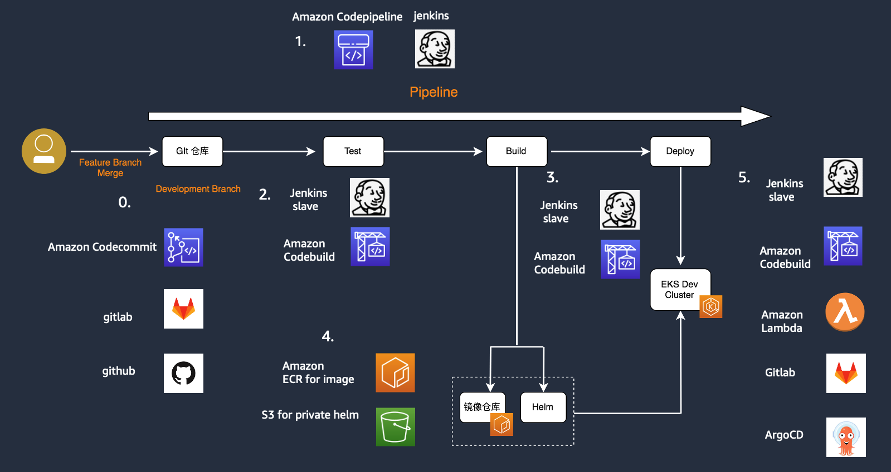

# Devops Workshop

Devops Workshop介绍基于AWS EKS上进行CI/CD的最佳实践，其中包含创建EKS Cluster；安装和配置Jenkins，创建Jenkins Pipeline，测试Jenkins CI/CD流程；通过Cloudformation模版创建Codecommit、Codebuild和CodePipeline资源，创建pipeline，测试CodePipeline的CI/CD流程。

Jenkins和CodePipeline的实验步骤中，多采用了script和Cloudformation模版，方便植入到基于AWS EKS的Devops pipeline中。

下图是Devops的常见流程。

下面是Devops Workshop的实验步骤。

## 1. [Login to AWS Console](01.login-to-aws-console.md)

## 2. [Set up EKS Cluster](02.setup-eks-cluster.md)

## 3. [Install and Configure Jenkins, Build Jenkins CI pipeline](03.install-config-jenkins.md)

## 4. [Jenkins CI/CD pipeline](04.jenkins-cicd.md)

## 5. [Codepipeline installation and CI/CD pipeline](05.setup-codepipeline.md)

